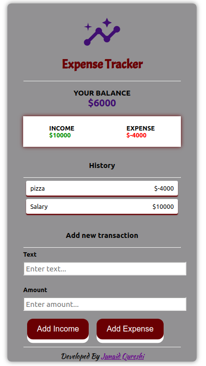

# Expense Tracker Web Application

http://your-expense-tracker.surge.sh/
### *An Expense Tracker Application that keeps track of your income and expenses*

## Task
Built this app to practice and polish my HTML5, CSS3, Javascript-es6, and Web App Development Skills.

## Functionality
 - Add and View Income
 - Add and View Expenses
 - View Current Balance
 - View History of All income and expenses

## Run Locally 

- Run this command `git clone https://github.com/qjunaid623/expenseTracker/`
- You are now in the dev environment and you can play around 

## Tech Stack

- HTML5
- CSS3
- Javascript ES6
- React
- React Hooks
- VS Code
- Surge
- Github Actions
