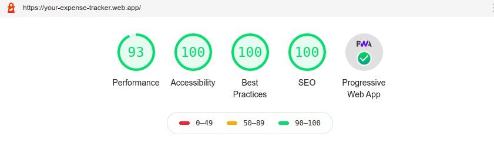

# Expense Tracker Web Application

### On PC

### On Mobile

### Lighthouse Performance Testing Result

### link : https://your-expense-tracker.web.app/

### _An Expense Tracker Application that keeps track of your income and expenses, You can install it on your devices (Mobile, Desktop)_

## Functionalities

- Add Income and Expenses
- View Income, Expenses, Current Balance.

## PWA Functionalities

- You can install it on PC, Mobile
- Offline availablity
- Push Notifications Services

## Features

- Secure
- Accessibility Optimized
- Fast
- Less in size
- SEO Optimized
- Mobile Responsive

## Run Locally

- Run this command `git clone https://github.com/developer-junaid/Expense-Tracker.git`
- You are now in the dev environment and you can play around

## Tech Stack

- HTML5
- CSS3
- Javascript +ES6
- Sass
- React Js
- Service Workers
- Firebase hosting
